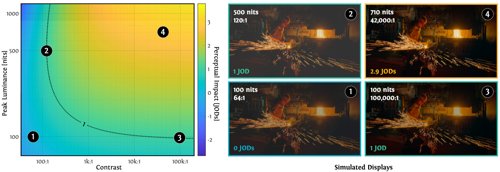

<div align="center">

<h1>What is HDR? Perceptual Impact of Luminance and Contrast in Immersive Displays</h1>

[**Kenneth Chen**](https://kenchen10.github.io/)<sup>1</sup>,
[**Nathan Matsuda**](https://www.nathanmatsuda.com)<sup>2</sup>,
[**Jon McElvain**](https://www.linkedin.com/in/jon-mcelvain-23450225/)<sup>2</sup>,
[**Yang Zhou**](https://scholar.google.com/citations?user=alcGReEAAAAJ&hl=en)<sup>2</sup>,
[**Thomas Wan**](https://www.linkedin.com/in/thomas-cc-wan)<sup>2</sup>,
[**Qi Sun**](https://qisun.me/)<sup>1&dagger;</sup>,
[**Alexandre Chapiro**](https://achapiro.github.io/)<sup>2&dagger;</sup>


&dagger; Equal contribution &emsp;

<sup>1</sup>
<a href="https://www.immersivecomputinglab.org/research/"></a>
&emsp;
<sup>2</sup>
<a href=""></a>

<!-- <a href="https://arxiv.org/abs/2407.01866"></a> -->
<a href="https://kenchen10.github.io/projects/sig25/index.html"></a>

</div>


<div style="width: 90%; margin: 0 auto;">

  <sub>
  A model to predict perceptual impact (in Just-Objectionable-Differences, or JODs) is derived from HDR preference data for combinations of display contrast and peak luminance, with predictions visualized as a heatmap (left). In this plot, the baseline 0 JOD condition is set to values similar to commercially- available VR displays: 100 nits peak luminance and 64:1 contrast. In addition, we simulate 3 displays with different dynamic ranges. Our model allows us to examine the perceived improvement from increased peak luminance and contrast. For example, both display 2 and 3 provide a 1 JOD improvement over display 1. Note that HDR content cannot be displayed in a PDF format, so all images in this manuscript are tone-mapped for presentation. See our supplementary webpage for representative content.
  </sub>
  <br><br>
  The contrast and luminance capabilities of a display are central to the quality of the image. High dynamic range (HDR) displays have high luminance and contrast, but it can be difficult to ascertain whether a given set of characteristics qualifies for this label. This is especially unclear for new display modes, such as virtual reality (VR). This paper studies the perceptual impact of peak luminance and contrast of a display, including characteristics and use cases representative of VR. To achieve this goal, we first developed a haploscope testbed prototype display capable of achieving 1k nits peak luminance and 1M:1 contrast with high precision. We then collected a novel HDR video dataset targetting VR-relevant content types. We also implemented custom tone mapping operators to map between display parameter sets. Finally, we collected subjective preference data spanning 3 orders of magnitude in each dimension. Our data was used to fit a model, which was validated using a subjective study on an HDR VR prototype headmounted display (HMD). Our model helps provide guidance for future display design, and helps standardize the understanding of HDR.
</div>

## Acknowledgements
We thank Ken Koh for creating HDR productivity content and Maurizio Nitti for rendering and designing HDR teddy bear scenes. Thanks to Dennis Pak for designing/constructing the haploscope and the mirror setup. Calibration of the EIZO display could not have been accomplished without the support of Yuta Asano. Thank you to Ben Mills for building the enclosure of our haploscope, for calibration of displays, as well as binocular calibration and alignment of mirrors. Thanks go to Will McCann and Xin Li, who supported the construction of the hardware and mirror fabrication. This project would not have been successful without the support of Fartun Sheygo and Alex Gherman, who conducted the main study, Nour Shoora who organized it, the user study participants for their time, and John Hill and Romain Bachy for help with logistics. Thanks go to Henry Milani for providing a PR-745 for validation of our displays, and Reza Saeedpour for support with using the device. Thank you to Dounia Hammou for providing pointers to HDR video datasets, Professor Rafał Mantiuk for the many discussions related to tone mapping and more, and Daryn Blanc-Goldhammer for comments on our work. We are grateful to Alexis Terterov for conducting the validation study, and EIZO support team for help debugging HDR displays. Thanks to Doug Lanman for discussions. Finally, thank you to Jenna Kang, Niall Williams, and Colin Groth for help with figure style. This work is partially supported by National Science Foundation grant #2225861, and a DARPA ICS program.

## Citation
If you find this project helpful to your research, please consider citing us:
```bibtex
@inproceedings{
 chen2025whatishdr,
 author = {Chen, Kenneth and Matsuda, Nathan and McElvain, Jon and Zhao, Yang and Wan, Thomas and Sun, Qi and Chapiro, Alexandre},
 title = {What is HDR? Perceptual Impact of Luminance and Contrast in Immersive Displays},
 year = {2025},
 isbn = {9798400715402},
 publisher = {Association for Computing Machinery},
 address = {New York, NY, USA},
 url = {https://doi.org/10.1145/3721238.3730629},
 doi = {10.1145/3721238.3730629},
 booktitle = {Proceedings of the Special Interest Group on Computer Graphics and Interactive Techniques Conference Conference Papers},
 articleno = {40},
 numpages = {11},
 keywords = {High Dynamic Range, Displays, Visual Perception, Virtual Reality},
 series = {SIGGRAPH Conference Papers '25}
 } 

```